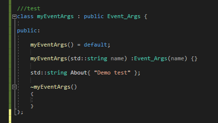
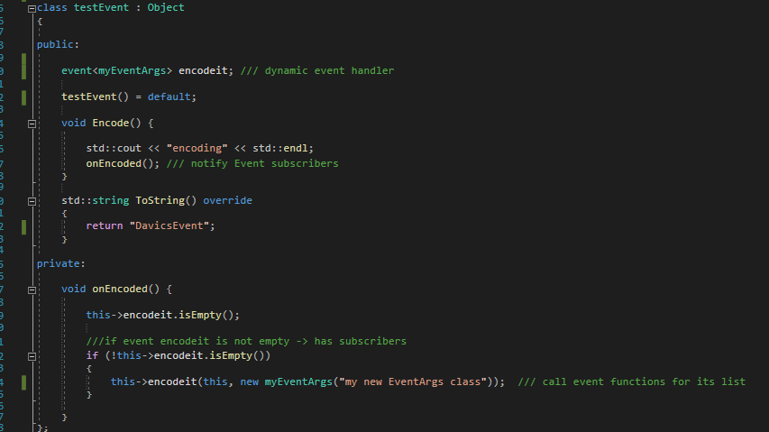
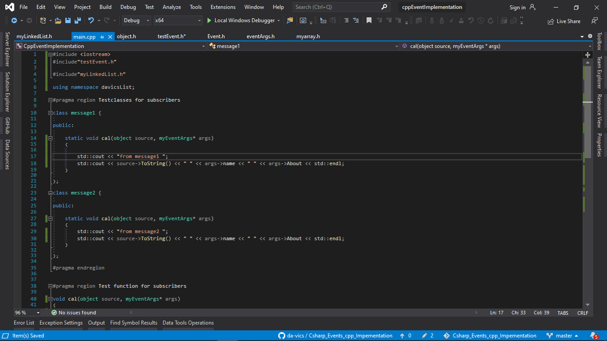
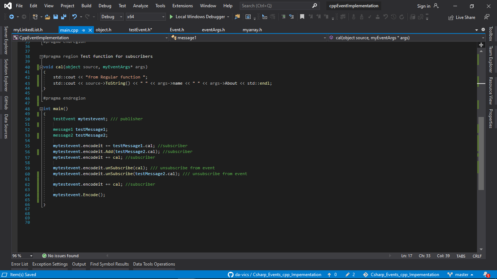
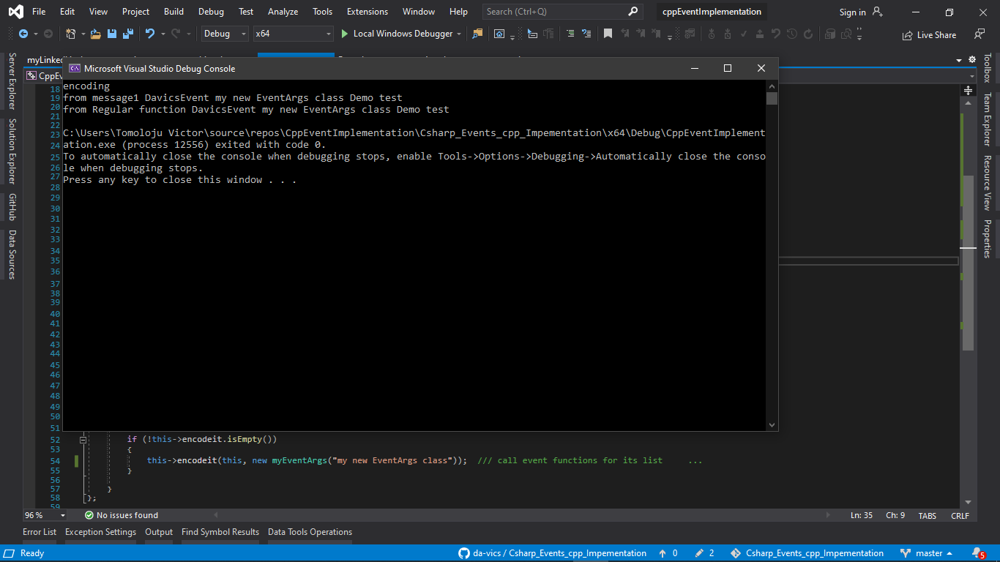

<h2 align="middle">Implementation Steps</h3>

<h4>Optional: Define Your own EventArgs Class inheriting from the Event_Args base class or use the default base class</h4>

 </img>

<h4>Create your Implentation class and inherit form the object base class and implement the virtual ToString function</h4>

 </img>

<h4>Create your functions to match the image below</h4>

 </img>

<h4>Subscribe and unsubsribe as shown below</h4>

 </img>

<h4>Program Output</h4>

 </img>
</div
